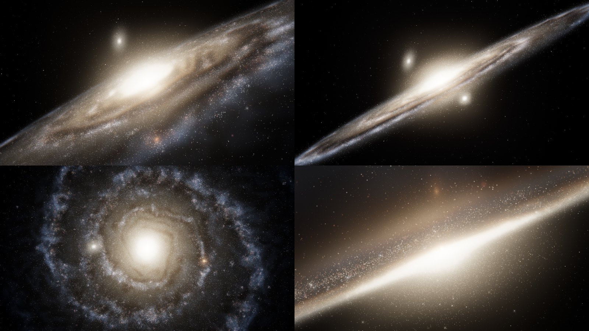

# Andromeda Galaxy

**Visualização procedural interativa de M31 em tempo real** · Three.js · WebGL 2 · GLSL · sem build


## Descrição

Uma experiência 3D interativa da Galáxia de Andrômeda (M31, NGC 224), executada inteiramente no navegador com WebGL 2 e shaders GLSL.

Nada aqui é uma foto. A galáxia é **construída pelo sistema** a partir de um modelo procedural com semente fixa: centenas de milhares de estrelas em órbita, um núcleo luminoso, o disco, os braços espirais, faixas de poeira que absorvem a luz de verdade, halo, aglomerados globulares, as galáxias satélites M32 e M110 e um campo estelar profundo. As fotografias de M31 serviram apenas de referência de aparência.

Tudo roda a partir de arquivos estáticos: não há `npm install`, bundler nem etapa de build. O Three.js vem junto, em `vendor/`, então o projeto também funciona **offline**.



## Tecnologias

| Tecnologia | Uso |
| --- | --- |
| [Three.js r170](https://threejs.org/) | Renderer WebGL, câmera, geometrias, materiais (incluído em `vendor/`) |
| WebGL 2 + GLSL | Órbitas, poeira, luz volumétrica e cores calculadas na GPU |
| JavaScript (ES Modules) | Lógica da cena, sem frameworks |
| HTML5 + CSS3 | HUD, painel de controles e avisos |
| `OrbitControls` | Câmera interativa (addon oficial do Three.js) |
| `EffectComposer`, `RenderPass`, `UnrealBloomPass`, `OutputPass` | HDR, bloom e tone mapping (addons oficiais) |
| PowerShell | Servidor local e launcher do Windows (`iniciar.bat`) |

## Características

A galáxia é feita de várias camadas que trabalham juntas. Unidade da cena: **1 kpc** (≈ 3 260 anos-luz).

### Núcleo galáctico
- Núcleo compacto extremamente denso e um **bulbo grande, achatado e levemente triaxial** (perfil de Hernquist), com dezenas de milhares de estrelas quentes.
- A luz do bulbo é uma soma de **elipsoides gaussianos integrados exatamente** ao longo de cada raio (função erro): branco no centro, creme, amarelo e dourado nas bordas, com profundidade real em qualquer ângulo. O pico HDR alimenta o bloom.

### Disco estelar
- Disco antigo exponencial (escala ~5 kpc) com espessura vertical e leve alargamento para fora: as estrelas não estão num plano.
- Cada estrela percorre uma **órbita levemente elíptica** cuja orientação gira com o raio. Onde as elipses se aglomeram surgem os braços (**ondas de densidade**). Assim as estrelas mantêm a **rotação diferencial** (mais rápidas perto do centro, curva de rotação que sobe e fica plana) e atravessam os braços sem nunca "enrolá-los", mesmo com a página aberta por horas. Um teste acelerou 26 voltas do padrão e a estrutura continuou igual.
- Pequena oscilação vertical de cada estrela através do disco.

### Braços espirais
- Dois braços logarítmicos bem enrolados (inclinação ~11°), esporas mais abertas e o **anel de formação estelar de ~10 kpc**, característico de M31, levemente descentralizado.
- Tudo deformado por ruído (*domain warping*): os braços se curvam, se partem em segmentos, formam nuvens estelares, regiões mais abertas e mais compactas. Nenhuma curva é matematicamente perfeita.
- Estrelas jovens posicionadas por amostragem no próprio mapa procedural, **associações OB** (aglomerados azuis), **supergigantes** com halo discreto e brilhos rosados de **regiões HII**.

### Populações estelares e cores
- Rampa de temperatura aproximando um corpo negro: branco, branco-azulado, azul claro, amarelo, amarelo quente e poucas alaranjadas/vermelhas.
- O centro é branco/amarelado, o disco interno creme e os braços externos branco-azulados. O azul fica nos braços, não na galáxia inteira.

### Faixas de poeira
- Faixas na borda interna dos braços, o anel de poeira perto de 10 kpc, arcos apertados ao redor do bulbo, filamentos e manchas, mais uma poeira difusa fina em todo o disco.
- A poeira **absorve**, não é pintada: cada estrela calcula no vertex shader a coluna de poeira entre ela e a câmera (forma fechada com erf) e é atenuada por `exp(-τ)`. A luz difusa é integrada da frente para trás, então a luz do bulbo atrás do lado próximo do disco é cortada pelas faixas.
- A luz azul é absorvida ~2× mais que a vermelha: as faixas ficam marrons e as transições são suaves.

### Luz difusa volumétrica
- O brilho contínuo de uma galáxia fotografada (bilhões de estrelas não resolvidas), construído em 3D: para cada pixel, o raio da câmera atravessa o bulbo, a camada antiga, a camada jovem azul, as regiões HII e a poeira. Muda de forma quando a câmera se move e funciona com a câmera dentro da galáxia.

### Halo
- Nuvem esparsa e achatada de estrelas antigas acima e abaixo do disco, e **aglomerados globulares** do tamanho real (3–9 pc): de longe parecem estrelas difusas, de perto se resolvem em estrelas.

### Galáxias satélites
- **M32** (elíptica compacta, logo além da borda próxima do disco) e **M110** (elíptica alongada e difusa, acima do lado distante), com estrelas e brilho difuso analítico. Discretas, sem roubar o foco.

### Campo estelar do universo
- Dezenas de milhares de estrelas da nossa galáxia em camadas entre 900 e 5 000 kpc (paralaxe ao orbitar), mais densas ao longo da faixa da Via Láctea, com tamanhos, intensidades e cores diferentes, muitas extremamente fracas e cintilação muito sutil.
- Algumas centenas de estrelas brilhantes com halo e raios de difração discretos, e galáxias de fundo muito fracas.

### Rotação, câmera e pós-processamento
- Rotação extremamente lenta e diferencial (o padrão espiral dá uma volta a cada 10 min em 1×; perto do bulbo as estrelas giram ~4× mais rápido).
- `OrbitControls` com inércia, limites de zoom (a câmera nunca entra no núcleo), rotação automática lenta que pausa enquanto você interage e **reset** com voo suave.
- **Lente dinâmica**: teleobjetiva na vista inicial (como as fotos, quase sem perspectiva), abrindo progressivamente ao se aproximar, para imersão e profundidade.
- **Adaptação de exposição** pela distância, como o olho: perto do núcleo ele não vira uma mancha branca.
- HDR em half float, `UnrealBloomPass` com pesos que favorecem um brilho justo (núcleo e estrelas fortes, sem névoa na tela toda), tone mapping ACES, sRGB, vinheta leve e dithering (sem faixas nos degradês).

### Robustez
- Randomização determinística (`?seed=`): a galáxia é a mesma a cada carregamento.
- Cada população é uma única `BufferGeometry` + `THREE.Points` (uma draw call), com atributos customizados. Nenhum objeto JavaScript por estrela e nenhuma alocação no loop de animação.
- Aberto via `file://`, mostra instruções em vez de tela preta, sem erros de CORS. Se o navegador perder o contexto WebGL, avisa e recarrega.

## Como executar

> **Dois cliques no `index.html` não funcionam.** Os navegadores bloqueiam módulos JavaScript em arquivos abertos direto do disco (`file://`). Nesse caso a própria página mostra as instruções abaixo. O projeto precisa ser aberto por um servidor local (`http://localhost`).

### Windows: dois cliques em `iniciar.bat` (recomendado)

1. Baixe o projeto (*Code → Download ZIP*) e extraia a pasta.
2. Dê dois cliques em **`iniciar.bat`**.
3. Na primeira vez, a janela preta explica e pergunta se pode configurar o Windows para usar a **placa de vídeo de alto desempenho** no navegador (veja [GPU dedicada](#gpu-dedicada)). Aperte **Enter** (sim) ou digite `n`.
4. O projeto abre numa janela própria do Chrome (ou Edge), já pedindo a placa dedicada. Deixe a janela preta aberta enquanto usa o projeto; feche-a para parar.

O `iniciar.bat` roda `tools/servidor.ps1`, um mini servidor em PowerShell (já vem no Windows). Nada é instalado. Se o Windows perguntar se pode executar o arquivo baixado, clique em *Mais informações → Executar assim mesmo*.

Opções (num prompt de comando, na pasta do projeto):

```bat
iniciar.bat -Quality ultra        :: fixa o perfil (ultra, high, medium, low)
iniciar.bat -DefaultBrowser       :: abre no navegador padrão, numa aba comum
iniciar.bat -NoGpuPreference      :: nunca pergunta sobre a preferência de GPU
iniciar.bat -Port 9000            :: primeira porta tentada (usa a próxima livre)
```

### Qualquer sistema: servidor estático manual

```bash
git clone https://github.com/Helio965/Galaxia_de_Andromeda.git
cd Galaxia_de_Andromeda

# Python 3
python -m http.server 8000

# ou Node.js
npx serve .
```

Depois abra **http://localhost:8000**. No VS Code, a extensão *Live Server* também funciona. Como o site é 100% estático, ele também funciona no GitHub Pages sem alterações.

### Parâmetros de URL

| URL | Efeito |
| --- | --- |
| `?quality=ultra` | Força o perfil ULTRA |
| `?quality=high` | Força o perfil HIGH |
| `?quality=medium` | Força o perfil MEDIUM |
| `?quality=low` | Força o perfil LOW |
| `?adaptive=off` | Desliga todo ajuste automático (benchmarks e capturas) |
| `?seed=42` | Gera uma galáxia irmã com outra semente |

Com o perfil forçado, a qualidade só é reduzida se houver **risco real de travamento** (menos de 12 FPS por ~6 s seguidos); o HUD então mostra `reduzido`.

## GPU dedicada

**Aceleração de hardware.** O WebGL sempre desenha na placa de vídeo, a menos que a aceleração de hardware do navegador esteja desligada: aí a cena é desenhada na **CPU** (SwiftShader, "Basic Render Driver") e fica muito lenta.

**GPU integrada × dedicada.** Muitos notebooks têm duas placas: uma **integrada** (Intel UHD/Iris, AMD Radeon Graphics), econômica e mais fraca, e uma **dedicada** (NVIDIA GeForce/RTX, AMD Radeon RX), bem mais rápida. **Quem escolhe qual placa o navegador usa é o Windows, não a página.** A página só pode pedir a mais rápida, e este projeto pede: o `WebGLRenderer` é criado com `powerPreference: 'high-performance'`. Mesmo assim o Windows costuma entregar a integrada ao navegador.

Por isso o `iniciar.bat` (mesma estratégia do projeto Black Hole):

- **abre uma janela separada do Chrome/Edge** (`--app`, maximizada) com **perfil próprio** em `%LOCALAPPDATA%\AndromedaGalaxy` e a opção `--force-high-performance-gpu`. Por ser outra instância do navegador, isso vale mesmo com o seu Chrome já aberto, e não mexe nas suas abas nem no seu perfil;
- **se você aceitar**, grava a preferência "Alto desempenho" do Windows para esse navegador: `GpuPreference=2;` em `HKEY_CURRENT_USER\Software\Microsoft\DirectX\UserGpuPreferences`. É exatamente o que faz *Configurações → Sistema → Tela → Elementos gráficos*, e pode ser desfeito por lá. Antes de gravar, o script mostra o programa, a chave e o valor. Outras opções do mesmo valor são preservadas, **nenhuma outra configuração do Windows é alterada**, e se você responder `n` a pergunta não volta.

**Diagnóstico.** O HUD mostra qual GPU o navegador está realmente usando (lida via `WEBGL_debug_renderer_info`), o FPS ao vivo, o perfil e o número de estrelas:

| Indicador | Significado |
| --- | --- |
| 🟢 `GeForce RTX 3050 Laptop GPU` | placa dedicada (ou Apple M): tudo certo |
| 🟠 `Intel UHD Graphics` / `AMD Radeon Graphics` | GPU integrada: funciona com menos estrelas; siga os passos abaixo |
| 🔴 `CPU / Software Renderer` | sem aceleração de hardware: comece pelo passo 1 |

Com GPU integrada ou CPU, um cartão explica o que fazer (abre sozinho na primeira vez). Para configurar manualmente (no Edge, troque `chrome://` por `edge://`):

1. No Chrome, **Configurações → Sistema → Usar aceleração de gráficos quando disponível**: ligado.
2. No Windows 10/11, **Configurações → Sistema → Tela → Elementos gráficos**, escolha o **Google Chrome** (ou adicione `C:\Program Files\Google\Chrome\Application\chrome.exe`), **Opções → Alto desempenho → Salvar**.
3. Alternativa: `chrome://flags/#force-high-performance-gpu` → **Enabled** → **Relaunch**.
4. Alternativa pelo driver: **Painel de Controle da NVIDIA → Gerenciar as configurações em 3D → Configurações de programa → Google Chrome → Processador NVIDIA de alto desempenho**.
5. Deixe o notebook **na tomada** e **feche e abra o navegador de novo** (a escolha da placa só vale para um navegador recém-aberto).

Para conferir: ponto verde no HUD, ou `chrome://gpu` → *GL_RENDERER*.

## Controles

| Ação | Mouse / teclado | Toque |
| --- | --- | --- |
| Orbitar | botão esquerdo + arrastar | arrastar com um dedo |
| Zoom | roda do mouse | pinça |
| Pausar / continuar | `Espaço` | botão **Pausar** |
| Resetar câmera | `R` | botão **Resetar câmera** |
| Abrir / fechar o painel | botão **Controles** (`Esc` fecha) | botão **Controles** |

Painel (recolhível; no celular ocupa pouco espaço e rola):

| Controle | Faixa | Descrição |
| --- | --- | --- |
| Velocidade da galáxia | 0 – 4× | Ritmo da rotação (0 congela as órbitas) |
| Densidade estelar | 10 – 100% | Fração das estrelas desenhadas (as restantes ficam mais brilhantes para manter a luz) |
| Intensidade do núcleo | 0 – 2.5 | Brilho do bulbo e do núcleo |
| Braços espirais | 0 – 2 | Luz azul dos braços, estrelas jovens, supergigantes e HII |
| Poeira | 0 – 2 | Opacidade das faixas de poeira (0 desliga) |
| Bloom | 0 – 2 | Intensidade do brilho HDR (0 desliga) |
| Estrelas de fundo | 0 – 2 | Brilho do céu (0 esconde) |
| Inclinação | −40° – +60° | Inclina a galáxia em relação à vista inicial |
| Exposição | 0.3 – 2.5 | Exposição do tone mapping |
| Rotação automática | on/off | Órbita lenta da câmera (~4,5 min por volta) |
| Pausar | — | Congela a galáxia (a câmera continua livre) |
| Resetar câmera | — | Volta suavemente à vista inicial |

Quem prefere movimento reduzido (`prefers-reduced-motion`) recebe a galáxia mais lenta e a rotação automática desligada.

## Qualidade

O perfil é escolhido pela GPU que o navegador está realmente usando:

| Perfil | Quando | Estrelas da galáxia | Céu | Luz difusa | Mapa | Pixel ratio |
| --- | --- | --- | --- | --- | --- | --- |
| **ULTRA** | GPU dedicada potente (RTX, RX 5000+, Arc A5/A7) | **355 400** | 45 000 + 420 brilhantes + 260 galáxias | 100% da resolução, até 32 amostras/raio | 2048² | até 2 |
| **HIGH** | outras dedicadas, Apple M, GPU desconhecida | **233 000** | 32 000 + 320 + 160 | 85%, até 24 | 2048² | até 1.75 |
| **MEDIUM** | GPU integrada, NVIDIA MX, tablets | **127 600** | 18 000 + 220 + 80 | 60%, até 14 | 1024² | até 1.25 |
| **LOW** | celulares, CPU (software) | **63 800** | 9 000 + 140 | 50%, até 8 | 1024² | 1 (1.5 no celular) |

As estrelas da galáxia somam núcleo/bulbo, disco, braços (com associações OB), supergigantes, halo (com aglomerados globulares) e satélites. A resolução da luz difusa é relativa aos pixels CSS: em telas 4K/retina ela não custa 4× mais.

**Governador de FPS.** Se a média ficar abaixo de 45 FPS por duas janelas seguidas de 2 s, a qualidade desce um degrau e o sistema espera 3 s antes de avaliar de novo (nunca oscila): primeiro a resolução, depois a resolução e as amostras da luz difusa, depois a densidade de estrelas, o céu e os efeitos finais. Cada ajuste aparece no console (`console.info`) e o HUD passa a mostrar `ajustado`.

**Como os números foram escolhidos.** Este ambiente de desenvolvimento não tem GPU física: os testes rodaram no Chromium com SwiftShader (renderização por CPU). Medindo cada camada separadamente, a luz difusa volumétrica é o que mais custa; 355 mil estrelas em 7 draw calls custam pouco. Os perfis foram dimensionados a partir desse custo relativo e do trabalho por quadro (vértices, fragmentos misturados, amostras de volume), mirando 60 FPS numa GPU dedicada de notebook (classe RTX 3050) em 1080p. Se a sua máquina não acompanhar, o governador corrige sozinho; com `?quality=` você fixa o perfil.

## Estrutura do projeto

```
/
├── index.html              # página, importmap do Three.js local, HUD e painel
├── iniciar.bat             # Windows: dois cliques para abrir com a GPU de alto desempenho
├── css/
│   └── style.css           # tela cheia, HUD, painel e avisos (responsivo)
├── js/
│   ├── main.js             # renderer WebGL 2, cena, loop, cadeia de qualidade adaptativa
│   ├── config.js           # modelo de M31: dimensões, rotação, braços, orçamento de luz
│   ├── galaxy.js           # monta M31 num grupo com uniforms compartilhados
│   ├── galaxyMap.js        # mapa procedural (poeira, braços, HII) gerado na GPU
│   ├── galacticCore.js     # bulbo + núcleo (estrelas e componentes de luz)
│   ├── stellarDisk.js      # disco antigo em órbitas de ondas de densidade
│   ├── spiralArms.js       # estrelas jovens, associações OB, supergigantes, HII
│   ├── dustLanes.js        # modelo de extinção da poeira
│   ├── diffuseLight.js     # luz difusa volumétrica (bulbo + disco + poeira)
│   ├── halo.js             # halo estelar e aglomerados globulares
│   ├── satellites.js       # M32 e M110
│   ├── backgroundStars.js  # campo estelar, estrelas brilhantes e galáxias de fundo
│   ├── starPoints.js       # uma população = uma BufferGeometry + THREE.Points
│   ├── postprocessing.js   # HDR, passe da luz difusa, bloom, tone mapping, vinheta
│   ├── camera.js           # OrbitControls, enquadramento, lente dinâmica, reset, rotação automática
│   ├── gpu.js              # descobre qual placa de vídeo o navegador usa
│   ├── quality.js          # perfis ULTRA/HIGH/MEDIUM/LOW e governador de FPS
│   ├── ui.js               # HUD, painel, atalhos, cartão de ajuda da GPU
│   ├── random.js           # PRNG com semente e distribuições
│   └── shaders/
│       ├── common.glsl.js    # ruído simplex, integrais gaussianas (erf), cores, extinção
│       ├── map.glsl.js       # gerador do mapa procedural
│       ├── stars.glsl.js     # estrelas da galáxia (movimento na GPU), supergigantes, HII
│       ├── volume.glsl.js    # integração volumétrica da luz difusa
│       ├── satellite.glsl.js # brilho difuso de M32/M110
│       └── sky.glsl.js       # céu de fundo
├── tools/
│   └── servidor.ps1        # servidor local em PowerShell + preferência de GPU do Windows
├── vendor/three/           # Three.js r170 (MIT) e os addons usados
├── docs/                   # imagens deste README
├── .gitattributes          # CRLF para .bat/.ps1 (também no ZIP do GitHub)
├── .gitignore
└── LICENSE
```

## Referências e ponto de partida

- **Vídeo de referência** (animação simples de partículas em espiral): foi apenas o conceito inicial. Aqui ele virou uma galáxia em camadas, tridimensional, com poeira que absorve luz, populações estelares, rotação diferencial e uma câmera cinematográfica.
- **Projeto Black Hole**: referência técnica de arquitetura (ES Modules sem build), perfis de qualidade, governador de FPS, detecção de GPU e o launcher do Windows com a GPU de alto desempenho. Nada da física do buraco negro (lente, disco de acreção, Doppler) foi reaproveitado.
- **Fotografias de M31**: referência visual de cor, inclinação (~77°), bulbo, faixas de poeira, anel azul e posição das satélites. Nenhuma imagem é usada na cena.

## Observações

> Isto é uma visualização artística **inspirada** em dados reais de M31, não uma simulação científica. Escalas, cores e brilhos foram ajustados para lembrar as fotografias; a dinâmica (ondas de densidade, curva de rotação) é uma aproximação visual, não um cálculo gravitacional.

## Licença

Distribuído sob a licença **MIT**. Veja [LICENSE](LICENSE).

Three.js © 2010-2024 Three.js Authors (MIT, `vendor/three/LICENSE`). O ruído simplex em GLSL é de Ashima Arts / Stefan Gustavson ([webgl-noise](https://github.com/ashima/webgl-noise), MIT).
