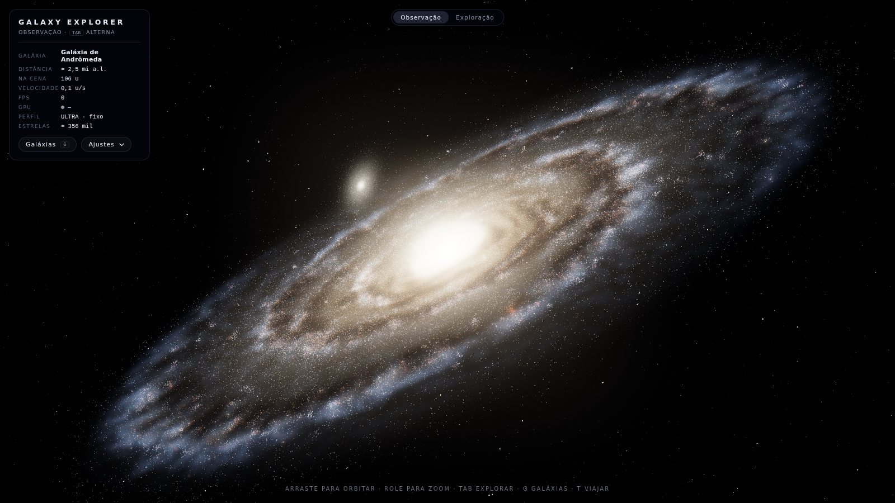
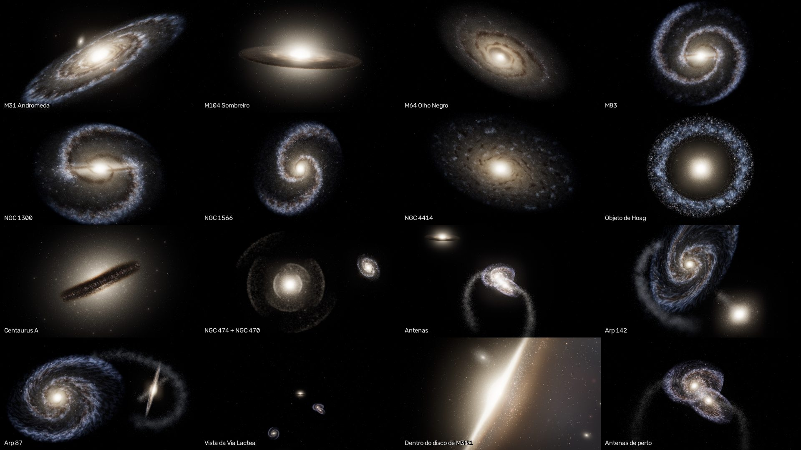

# Galaxy Explorer

**Explorador 3D interativo de galáxias reais, gerado em tempo real** · Three.js · WebGL 2 · GLSL · sem build · funciona offline



## Descrição

O projeto começou como uma visualização procedural da **Galáxia de Andrômeda (M31)** e evoluiu para um **Interactive 3D Galaxy Explorer**: um pequeno universo navegável com **13 sistemas de galáxias reais**, cada um com a sua própria estrutura, para observar de perto, sobrevoar livremente ou visitar com um piloto automático cinematográfico.

Nada aqui é uma foto ou um plano com imagem. Cada galáxia é **construída pelo sistema** em 3D: centenas de milhares de estrelas, luz difusa integrada em volume, poeira que absorve a luz de verdade, halo, aglomerados, barras, anéis, conchas e caudas de maré, tudo procedural e com semente fixa. As fotografias serviram apenas de referência de aparência (veja [docs/GALAXY_REFERENCES.md](docs/GALAXY_REFERENCES.md)).

M31 continua sendo a galáxia mais detalhada (núcleo, bulbo, disco em órbitas de ondas de densidade, braços, regiões HII, poeira, halo, aglomerados globulares, M32 e M110, rotação diferencial e luz volumétrica) e, no perfil ULTRA, é desenhada com as mesmas 356 mil estrelas da versão original.

Tudo roda a partir de arquivos estáticos: não há `npm install`, bundler nem etapa de build. O Three.js vem junto, em `vendor/`.



## Galáxias

| Galáxia | Tipo | Constelação | Distância real | Estrutura procedural |
| --- | --- | --- | --- | --- |
| **Andrômeda** (M31, NGC 224) | Espiral | Andrômeda | ≈ 2,5 milhões de anos-luz | Bulbo triaxial, disco em ondas de densidade, anel de 10 kpc, braços fragmentados, HII, poeira, halo, globulares, M32 e M110 |
| **Sombreiro** (M104) | Espiral vista quase de perfil | Virgem | ≈ 28 milhões | Bojo gigante em 5 camadas, disco fino com anel de poeira escura, halo rico em globulares |
| **Olho Negro** (M64) | Espiral | Cabeleira de Berenice | ≈ 17 milhões | Anel de poeira denso e assimétrico junto ao núcleo, disco externo liso |
| **Cata-vento do Sul** (M83) | Espiral barrada | Hidra | ≈ 15 milhões | Barra que gira com o padrão, braços a partir das pontas, muitas regiões HII |
| **NGC 1300** | Espiral barrada | Erídano | ≈ 60 milhões | Barra longa com faixas de poeira na borda de ataque, dois braços abertos |
| **NGC 1566** | Espiral | Dourado | ≈ 60 milhões | Dois braços dominantes com aglomerados azuis e poeira, núcleo compacto |
| **NGC 4414** | Espiral (floculenta) | Cabeleira de Berenice | ≈ 60 milhões | Fragmentos curtos de braços e de poeira em vez de braços contínuos |
| **Objeto de Hoag** | Galáxia anelar | Serpente (Cabeça) | ≈ 550 milhões | Núcleo esferoidal, intervalo escuro, anel 3D irregular de aglomerados azuis |
| **Centaurus A** (NGC 5128) | Elíptica peculiar | Centauro | ≈ 13 milhões | Esferoide gigante cruzado por um disco de poeira empenado, com estrelas jovens |
| **NGC 474 + NGC 470** (Arp 227) | Galáxia com conchas + espiral | Peixes | ≈ 110 milhões (estimativa) | Conchas e laços estelares em torno do esferoide, espiral companheira |
| **Antenas** (NGC 4038/4039) | Par em fusão | Corvo | ≈ 45 milhões | Dois discos deformados por maré, região de contato cheia de HII, duas caudas de maré 3D |
| **Arp 142** (NGC 2936/2937) | Par em interação | Hidra | ≈ 400 milhões | Espiral esticada em forma de "pinguim", elíptica compacta (o "ovo"), corrente de maré |
| **Arp 87** (NGC 3808/3808A) | Par em interação | Leão | ≈ 330 milhões (estimativa) | Espiral com anel de formação estelar, companheira de perfil, ponte de matéria |

Os dados (tipo, constelação, distância, coordenadas) vêm de NASA, ESA/Hubble, ESA/Webb, ESO e NED, citados no cartão de cada galáxia e em [docs/GALAXY_REFERENCES.md](docs/GALAXY_REFERENCES.md). Quando a fonte não traz uma distância medida, o explorador mostra a estimativa pelo desvio para o vermelho e **diz que é uma estimativa**. Nenhum número foi inventado.

## Escalas: o que é real e o que é comprimido

> **As distâncias entre as galáxias estão comprimidas.** Em escala real, o Objeto de Hoag estaria 220 vezes mais longe que Andrômeda, e nenhuma outra galáxia caberia na mesma tela que ela. O explorador usa uma escala logarítmica: Andrômeda fica a 120 unidades do ponto de partida e cada fator 10 na distância real acrescenta 160 unidades.

- **Direções reais.** Cada galáxia está na sua direção verdadeira no céu (ascensão reta e declinação do NED), vista a partir do ponto de partida, a nossa Galáxia; o norte celeste aponta para cima. Por isso M104, M64, NGC 4414, Antenas, M83 e Centaurus A ficam do mesmo lado do céu, e Andrômeda do lado oposto. A faixa de estrelas da Via Láctea no fundo também está no plano galáctico real.
- **Dentro de uma galáxia**, 1 unidade ≈ 1 kpc ≈ 3 260 anos-luz, e os tamanhos são aproximadamente realistas; algumas galáxias pequenas foram um pouco ampliadas para continuarem legíveis.
- **No HUD e no cartão**, "Distância real" é a distância medida até a Terra; "Na cena" é a distância da câmera em unidades da cena (comprimida). As duas nunca se misturam.
- **Orientações** imitam a aparência nas fotografias: vistas do ponto de partida, as galáxias aparecem como nas imagens. São escolhas visuais, não medidas.

## Ciência × visualização

Isto é uma **visualização artística baseada em dados reais**, não uma simulação científica:

- A rotação é lenta e visual (ondas de densidade e curva de rotação aproximadas); não há simulação gravitacional N-corpos.
- Os sistemas em interação (Antenas, Arp 142, Arp 87, NGC 474) e Centaurus A ficam **congelados em um estado visual representativo**: essas colisões levam centenas de milhões de anos.
- Cores, brilhos, números de estrelas e detalhes procedurais foram ajustados para lembrar as fotografias.

## Tecnologias

| Tecnologia | Uso |
| --- | --- |
| [Three.js r170](https://threejs.org/) | Renderer WebGL, câmera, geometrias, materiais (incluído em `vendor/`) |
| WebGL 2 + GLSL | Órbitas, poeira, mapas procedurais, luz volumétrica e cores calculados na GPU |
| JavaScript (ES Modules) | Lógica da cena, sem frameworks |
| HTML5 + CSS3 | HUD, painéis, rótulos e radar |
| `OrbitControls` | Modo Observação (addon oficial do Three.js) |
| `EffectComposer`, `UnrealBloomPass`, `OutputPass` | HDR, bloom e tone mapping (addons oficiais) |
| PowerShell | Servidor local e launcher do Windows (`iniciar.bat`) |

## Como executar

> **Dois cliques no `index.html` não funcionam.** Os navegadores bloqueiam módulos JavaScript em arquivos abertos direto do disco (`file://`). Nesse caso a própria página mostra as instruções abaixo. O projeto precisa ser aberto por um servidor local (`http://localhost`).

### Windows: dois cliques em `iniciar.bat` (recomendado)

1. Baixe o projeto (*Code → Download ZIP*) e extraia a pasta.
2. Dê dois cliques em **`iniciar.bat`**.
3. Na primeira vez, a janela preta explica e pergunta se pode configurar o Windows para usar a **placa de vídeo de alto desempenho** no navegador (veja [GPU dedicada](#gpu-dedicada)). Aperte **Enter** (sim) ou digite `n`.
4. O explorador abre numa janela própria do Chrome (ou Edge), já pedindo a placa dedicada. Deixe a janela preta aberta enquanto usa o projeto; feche-a para parar.

O `iniciar.bat` roda `tools/servidor.ps1`, um mini servidor em PowerShell (já vem no Windows). Nada é instalado. Se o Windows perguntar se pode executar o arquivo baixado, clique em *Mais informações → Executar assim mesmo*.

Opções (num prompt de comando, na pasta do projeto):

```bat
iniciar.bat -Quality ultra        :: fixa o perfil (ultra, high, medium, low)
iniciar.bat -DefaultBrowser       :: abre no navegador padrão, numa aba comum
iniciar.bat -NoGpuPreference      :: nunca pergunta sobre a preferência de GPU
iniciar.bat -Port 9000            :: primeira porta tentada (usa a próxima livre)
```

### Qualquer sistema: servidor estático manual

```bash
git clone https://github.com/Helio965/Galaxia_de_Andromeda.git
cd Galaxia_de_Andromeda

# Python 3
python -m http.server 8000

# ou Node.js
npx serve .
```

Depois abra **http://localhost:8000**. No VS Code, a extensão *Live Server* também funciona. Como o site é 100% estático, ele também funciona no GitHub Pages sem alterações.

### Parâmetros de URL

| URL | Efeito |
| --- | --- |
| `?galaxy=m104` | Começa observando outra galáxia (`m31`, `m104`, `m64`, `m83`, `ngc1300`, `ngc1566`, `ngc4414`, `hoag`, `cena`, `ngc474`, `antennae`, `arp142`, `arp87`) |
| `?quality=ultra` · `high` · `medium` · `low` | Força um perfil de qualidade |
| `?adaptive=off` | Desliga todo ajuste automático (benchmarks e capturas) |
| `?seed=42` | Muda todas as sementes procedurais: as mesmas galáxias, com outros detalhes |
| `?debug=1` | Mostra posição da câmera, modo, galáxia ativa, LOD de cada galáxia, draw calls, memória da GPU, estrelas, FPS e velocidade |

Os parâmetros se combinam: `?galaxy=antennae&quality=high&debug=1`. Com o perfil forçado, a qualidade só é reduzida se houver **risco real de travamento** (menos de 12 FPS por ~6 s seguidos); o HUD então mostra `reduzido`.

## Navegação e controles

O explorador tem dois modos, alternados com **`TAB`** (ou pelos botões no topo da tela). A troca é suave: a câmera não salta.

### Observação (modo inicial)

Órbita em torno da galáxia escolhida, como no projeto original.

| Ação | Mouse / teclado | Toque |
| --- | --- | --- |
| Orbitar | botão esquerdo + arrastar | arrastar com um dedo |
| Zoom | roda do mouse | pinça |
| Voltar ao enquadramento inicial | `R` | botão **Resetar câmera** |

A lente é teleobjetiva no enquadramento inicial (como nas fotografias) e se abre ao aproximar. A câmera nunca entra no núcleo.

### Exploração (voo livre)

| Ação | Teclado / mouse | Toque |
| --- | --- | --- |
| Olhar em volta | clique na cena para capturar o mouse (`Esc` solta); sem captura, arraste | arrastar com um dedo |
| Frente / trás | `W` / `S` (ou setas) | afastar / juntar dois dedos |
| Esquerda / direita | `A` / `D` (ou setas) | — |
| Subir / descer | `E` / `Q` | — |
| Acelerar | `Shift` (quanto mais tempo segurado, mais rápido) | — |
| Devagar | `X` | — |
| Velocidade base | roda do mouse | — |

O movimento tem aceleração e inércia. A velocidade acompanha a escala: lenta e precisa dentro de uma galáxia, rápida no vazio entre elas. Não há paredes invisíveis; só um empurrão suave para fora do centro de uma galáxia. Em alta velocidade aparecem rastros discretos de poeira e a exposição se abre levemente.

### Viajar até uma galáxia

Escolha uma galáxia (clique nela, mire com a cruz no modo Exploração, ou use o painel **Galáxias**) e aperte **`T`** ou **Viajar até**. O piloto automático alinha a câmera, acelera, cruza o espaço, desacelera e chega ao enquadramento da fotografia da galáxia, entrando no modo Observação. A rota contorna os núcleos de outras galáxias, e as estrelas do destino são geradas durante a viagem. **Qualquer comando de movimento, clique, roda do mouse ou `Esc` cancela a viagem**, e a câmera para suavemente onde estiver.

### Atalhos

| Tecla | Ação |
| --- | --- |
| `TAB` | Observação ⇄ Exploração |
| `G` | Painel **Galáxias** (lista, seleção, informações) |
| `T` | Viajar até a galáxia selecionada (ou a que está na mira) |
| `O` | Observar a galáxia selecionada (ou a mais próxima) |
| `L` | Rótulos de todas as galáxias (por padrão só a selecionada e a da mira) |
| `M` | Radar |
| `H` | Ocultar / mostrar a interface |
| `C` | Modo cinematográfico (sem interface, faixas pretas, órbita automática) |
| `F` | Tela cheia |
| `P` | Salvar captura de tela (PNG) |
| `Espaço` | Pausar / continuar a rotação das galáxias (a câmera continua livre) |
| `R` | Voltar ao enquadramento inicial da galáxia observada |
| `Esc` | Cancelar viagem · sair do modo cinematográfico · fechar painéis · tirar a seleção |

Os atalhos são ignorados enquanto se digita num controle e com `Ctrl`, `Alt` ou `Cmd` pressionados (assim `Ctrl+W` continua fechando a aba).

## Interface

- **HUD "GALAXY EXPLORER"**: modo atual, galáxia em foco, distância real, distância na cena, velocidade, FPS, GPU, perfil e estrelas desenhadas.
- **Painel Galáxias** (`G`): as 13 galáxias com tipo e distância. Escolher uma a **seleciona** (destaque, rótulo e cartão); ela nunca é teletransportada.
- **Cartão de informação**: nome, designações, tipo, constelação, distância real (com a observação quando é estimativa), tamanho quando a fonte informa, distância na cena (marcada como escala comprimida), descrição e fontes com link. Botões **Viajar até** e **Observar**.
- **Rótulos** discretos sob as galáxias, **radar** com a direção de cada galáxia (para cima = à frente da câmera), estado da viagem e dicas de teclas que somem sozinhas.
- **Ajustes**: velocidade de rotação das galáxias, densidade estelar, núcleos, braços e formação estelar, poeira, bloom, estrelas de fundo, exposição, rastros de velocidade, rotação automática, pausar e resetar.
- Responsivo: no celular os painéis ocupam a largura da tela e a alternância de modos vai para baixo. A prioridade é o desktop.

## Níveis de detalhe e desempenho

- **Luz difusa sempre presente.** Toda galáxia existe desde o início como luz volumétrica (bulbo, disco, braços, poeira), barata quando ocupa poucos pixels. Um **farol** discreto mantém as galáxias muito distantes visíveis.
- **LOD 0–4 pelo tamanho aparente na tela** (distância ÷ raio, corrigida pela lente e pela altura da janela; galáxias fora do campo de visão contam como mais distantes):

  | LOD | Mostra |
  | --- | --- |
  | 0 | Todas as estrelas, mapa nítido, mais amostras de volume |
  | 1 | ~75% das estrelas |
  | 2 | ~40% das estrelas, aparecendo/sumindo em fade |
  | 3 | Só luz difusa (menos amostras) |
  | 4 | Luz difusa mínima + farol |

  As trocas têm **histerese** (sem piscar na fronteira) e **fade cruzado**; as mudanças com estrelas aparecem no console (`[GalaxyExplorer] LOD Andrômeda -> 1`).
- **Geração assíncrona.** As estrelas de uma galáxia são geradas quando ela começa a ficar grande na tela (ou assim que uma viagem até ela começa), **uma galáxia por vez e em fatias de alguns milissegundos por quadro**: a animação nunca trava e não há tela de carregamento nas viagens. Medido aqui: 0,17–0,46 s de CPU por galáxia no perfil ULTRA, espalhados por ~1 s de quadros. Saindo de perto, as estrelas somem em fade e a memória é liberada.
- **Orçamento global**: no máximo 2–3 galáxias com estrelas na memória e um teto de estrelas desenhadas ao mesmo tempo por perfil; todas as frações descem juntas se o teto for atingido.
- **Poucas draw calls**: cada população de estrelas é uma única `BufferGeometry` + `THREE.Points`, sem objetos JavaScript por estrela e sem alocação no loop de animação. Os shaders de todas as variantes são compilados na abertura, para que uma galáxia nova nunca cause engasgo.
- **Precisão**: o universo inteiro cabe em ~1 000 unidades e as matrizes são calculadas em precisão dupla no JavaScript; nada usa o depth buffer (toda a luz é aditiva). Por isso não foi necessário *floating origin* nem depth buffer logarítmico, e não há z-fighting.

## Qualidade

O perfil é escolhido pela GPU que o navegador está realmente usando:

| Perfil | Quando | Estrelas por galáxia (peso 1 = M31) | Teto desenhado | Galáxias com estrelas | Luz difusa | Mapa | Pixel ratio |
| --- | --- | --- | --- | --- | --- | --- | --- |
| **ULTRA** | GPU dedicada potente (RTX, RX 5000+, Arc A5/A7) | **356 000** | 560 000 | 3 | 100% da resolução, até 32 amostras/raio | 2048² | até 2 |
| **HIGH** | outras dedicadas, Apple M, GPU desconhecida | **233 000** | 360 000 | 3 | 85%, até 24 | 2048² | até 1.75 |
| **MEDIUM** | GPU integrada, NVIDIA MX, tablets | **128 000** | 190 000 | 2 | 60%, até 14 | 1024² | até 1.25 |
| **LOW** | celulares, CPU (software) | **64 000** | 90 000 | 2 | 50%, até 8 | 1024² | 1 (1.5 no celular) |

Cada galáxia tem um peso no catálogo (M31 = 1; as outras entre 0,5 e 0,75). O céu de fundo tem 45 000 / 32 000 / 18 000 / 9 000 estrelas.

**Governador de FPS.** Se a média ficar abaixo de 45 FPS por duas janelas seguidas de 2 s, a qualidade desce um degrau e o sistema espera 3 s antes de avaliar de novo (nunca oscila): primeiro a resolução, depois a resolução e as amostras da luz difusa, depois o orçamento de estrelas, o céu e os efeitos finais. Cada ajuste aparece no console e o HUD passa a mostrar `ajustado`.

## GPU dedicada

**Aceleração de hardware.** O WebGL sempre desenha na placa de vídeo, a menos que a aceleração de hardware do navegador esteja desligada: aí a cena é desenhada na **CPU** (SwiftShader, "Basic Render Driver") e fica muito lenta.

**GPU integrada × dedicada.** Muitos notebooks têm duas placas: uma **integrada** (Intel UHD/Iris, AMD Radeon Graphics), econômica e mais fraca, e uma **dedicada** (NVIDIA GeForce/RTX, AMD Radeon RX), bem mais rápida. **Quem escolhe qual placa o navegador usa é o Windows, não a página.** A página só pode pedir a mais rápida, e este projeto pede: o `WebGLRenderer` é criado com `powerPreference: 'high-performance'`. Mesmo assim o Windows costuma entregar a integrada ao navegador.

Por isso o `iniciar.bat` (mesma estratégia do projeto Black Hole):

- **abre uma janela separada do Chrome/Edge** (`--app`, maximizada) com **perfil próprio** em `%LOCALAPPDATA%\AndromedaGalaxy` e a opção `--force-high-performance-gpu`. Por ser outra instância do navegador, isso vale mesmo com o seu Chrome já aberto, e não mexe nas suas abas nem no seu perfil;
- **se você aceitar**, grava a preferência "Alto desempenho" do Windows para esse navegador: `GpuPreference=2;` em `HKEY_CURRENT_USER\Software\Microsoft\DirectX\UserGpuPreferences`. É exatamente o que faz *Configurações → Sistema → Tela → Elementos gráficos*, e pode ser desfeito por lá. Antes de gravar, o script mostra o programa, a chave e o valor. Outras opções do mesmo valor são preservadas, **nenhuma outra configuração do Windows é alterada**, e se você responder `n` a pergunta não volta.

**Diagnóstico.** O HUD mostra qual GPU o navegador está realmente usando (lida via `WEBGL_debug_renderer_info`), o FPS ao vivo, o perfil e o número de estrelas:

| Indicador | Significado |
| --- | --- |
| 🟢 `GeForce RTX 3050 Laptop GPU` | placa dedicada (ou Apple M): tudo certo |
| 🟠 `Intel UHD Graphics` / `AMD Radeon Graphics` | GPU integrada: funciona com menos estrelas; siga os passos abaixo |
| 🔴 `CPU / Software Renderer` | sem aceleração de hardware: comece pelo passo 1 |

Com GPU integrada ou CPU, um cartão explica o que fazer (abre sozinho na primeira vez). Para configurar manualmente (no Edge, troque `chrome://` por `edge://`):

1. No Chrome, **Configurações → Sistema → Usar aceleração de gráficos quando disponível**: ligado.
2. No Windows 10/11, **Configurações → Sistema → Tela → Elementos gráficos**, escolha o **Google Chrome** (ou adicione `C:\Program Files\Google\Chrome\Application\chrome.exe`), **Opções → Alto desempenho → Salvar**.
3. Alternativa: `chrome://flags/#force-high-performance-gpu` → **Enabled** → **Relaunch**.
4. Alternativa pelo driver: **Painel de Controle da NVIDIA → Gerenciar as configurações em 3D → Configurações de programa → Google Chrome → Processador NVIDIA de alto desempenho**.
5. Deixe o notebook **na tomada** e **feche e abra o navegador de novo** (a escolha da placa só vale para um navegador recém-aberto).

Para conferir: ponto verde no HUD, ou `chrome://gpu` → *GL_RENDERER*.

## Arquitetura

```
/
├── index.html                 # página, importmap do Three.js local, HUD, painéis
├── iniciar.bat                # Windows: dois cliques para abrir com a GPU de alto desempenho
├── css/style.css              # HUD, painéis, rótulos, radar, responsivo
├── js/
│   ├── main.js                # renderer, cena, modos, atalhos, loop, qualidade adaptativa
│   ├── config.js              # constantes comuns (sentido de rotação, curva de rotação)
│   ├── gpu.js                 # descobre qual placa de vídeo o navegador usa
│   ├── quality.js             # perfis ULTRA/HIGH/MEDIUM/LOW e governador de FPS
│   ├── work.js                # geração em fatias de tempo
│   ├── random.js              # PRNG com semente e distribuições
│   ├── backgroundStars.js     # céu de fundo (acompanha a câmera, plano galáctico real)
│   ├── postprocessing.js      # HDR, passe da luz difusa, bloom, tone mapping, vinheta
│   ├── universe/
│   │   ├── galaxyCatalog.js   # GALAXY_CATALOG: dados científicos + parâmetros visuais
│   │   ├── specTools.js       # mescla/escala de specs, orientação "como na foto"
│   │   ├── universe.js        # cria os sistemas, seleção, aquecimento dos shaders
│   │   ├── lodManager.js      # níveis de detalhe, geração/liberação, orçamento global
│   │   ├── beacons.js         # faróis das galáxias distantes
│   │   └── spaceDust.js       # rastros de velocidade
│   ├── galaxies/
│   │   ├── galaxySystem.js    # um sistema do catálogo: corpos + correntes de maré
│   │   ├── galaxyBody.js      # uma galáxia: mapa, luz difusa e populações de estrelas
│   │   ├── galaxyMap.js       # mapa procedural na GPU (braços, barra, anéis, poeira, maré)
│   │   ├── galacticCore.js    # bulbo/esferoide (estrelas + componentes de luz)
│   │   ├── stellarDisk.js     # disco antigo em órbitas de ondas de densidade
│   │   ├── spiralArms.js      # estrelas jovens, associações OB, supergigantes, HII
│   │   ├── bar.js             # barras
│   │   ├── shells.js          # conchas estelares (NGC 474)
│   │   ├── tidal.js           # caudas, pontes e correntes de maré
│   │   ├── halo.js            # halo e aglomerados globulares
│   │   ├── satellites.js      # M32 e M110
│   │   ├── diffuseLight.js    # luz difusa volumétrica
│   │   ├── dustLanes.js       # extinção da poeira
│   │   └── starPoints.js      # uma população = uma BufferGeometry + THREE.Points
│   ├── navigation/
│   │   ├── observer.js        # modo Observação (OrbitControls, lente, enquadramento)
│   │   ├── freeFlight.js      # modo Exploração (voo livre, inércia, toque)
│   │   └── travel.js          # piloto automático "Viajar até"
│   ├── ui/
│   │   ├── hud.js             # HUD, cartão de ajuda da GPU, dicas, carregamento
│   │   ├── controls.js        # painel de ajustes
│   │   ├── galaxyPanel.js     # lista de galáxias e cartão de informação
│   │   ├── labels.js          # rótulos
│   │   ├── radar.js           # radar
│   │   ├── debug.js           # sobreposição ?debug=1
│   │   └── format.js          # formatação de números
│   └── shaders/               # GLSL: ruído, erf, mapa, estrelas, volume, satélites, céu
├── tools/servidor.ps1         # servidor local em PowerShell + preferência de GPU do Windows
├── vendor/three/              # Three.js r170 (MIT) e os addons usados
├── docs/                      # imagens deste README e GALAXY_REFERENCES.md
└── LICENSE
```

**Como uma galáxia é descrita.** Cada entrada de `GALAXY_CATALOG` tem duas metades: a **científica** (nome, designações, tipo, constelação, distância, coordenadas, fontes) e a de **visualização** (posição comprimida, orientação, escala, cor, peso no orçamento de estrelas, semente, parâmetros procedurais e o que o LOD mais próximo mostra). As galáxias de disco partem do modelo de M31, mudam o que difere na sua estrutura (`overrides`) e são escaladas ao seu tamanho (`scaleSpec`); elípticas, conchas, barras e correntes de maré são componentes adicionais. Para incluir uma galáxia nova basta acrescentar uma entrada ao catálogo.

## Testes

Feitos neste ambiente de desenvolvimento, que **não tem GPU física**: Chromium sem interface (Playwright) com SwiftShader, ou seja, renderização na CPU, a 1–10 FPS. Os testes verificam o funcionamento, não o desempenho real.

| Teste | Resultado |
| --- | --- |
| Inicialização, console sem erros nem avisos | ok |
| As 13 galáxias renderizadas e comparadas com as fotografias de referência | ok (galeria acima) |
| Exploração: `TAB`, `W`, `Shift` progressivo, soltar as teclas (inércia) | ok |
| `TAB` de volta à Observação: o centro da órbita desliza até a galáxia | ok |
| Viagens: M31 → M104 → Antenas (cancelada no meio com `S`) → Hoag → Centaurus A → M31 | ok: fases, chegada no enquadramento, troca para Observação, geração do destino durante a viagem |
| LOD: trocas de nível, geração antecipada, cancelamento e liberação de estrelas | ok (mensagens no console) |
| `?galaxy=`, `?galaxy=` inexistente, `?seed=`, `?debug=1`, `?quality=` | ok |
| Perfis ULTRA / HIGH / MEDIUM / LOW | ok (M31: 356 014 / 233 009 / 128 004 / 64 003 estrelas) |
| Painel Galáxias, seleção sem teletransporte, `L`, `M`, `H`, `C`, `Esc`, `P` (PNG baixado), `Espaço`, `R`, `F` | ok |
| Redimensionar para 390×844 (celular) e voltar | ok, sem rolagem horizontal |
| Recarregar a página | ok |
| Aberto via `file://`: aviso com instruções | ok |
| Perda do contexto WebGL: aviso e recarga automática | ok |
| Lint (ESLint) e análise do `servidor.ps1` pelo parser do PowerShell 7 | ok |

**Não testado aqui** (sem acesso a esses ambientes): desempenho e FPS numa GPU real, Microsoft Edge, Firefox e Safari, a execução do `iniciar.bat` no Windows, a captura do mouse (pointer lock) com um mouse físico e o toque num aparelho real. O governador de FPS existe justamente para ajustar a qualidade à máquina de quem usa.

## Limitações

- As distâncias entre as galáxias são comprimidas e as orientações são visuais; não é um mapa em escala do universo.
- A dinâmica é visual: não há simulação gravitacional; os sistemas em interação estão congelados num instante representativo.
- As galáxias além de M31 têm menos estrelas que ela (pesos de 0,5 a 0,75 do orçamento) e não têm satélites.
- Conchas (NGC 474) e caudas de maré são aproximações: as fotografias profundas mostram estruturas mais tênues e mais finas.
- Dentro do bulbo de uma galáxia a cena fica muito clara (a luz difusa domina).
- Os números dos perfis foram dimensionados pelo custo relativo medido em CPU (SwiftShader), mirando 60 FPS numa GPU dedicada de notebook (classe RTX 3050) em 1080p; não foram medidos numa GPU real.

## Referências e créditos

- **Dados científicos**: NASA (Hubble Messier Catalog), ESA/Hubble, ESA/Webb, ESO e NASA/IPAC Extragalactic Database (NED). Lista completa por galáxia em [docs/GALAXY_REFERENCES.md](docs/GALAXY_REFERENCES.md).
- **Imagens de referência**: enviadas durante o desenvolvimento, usadas só como referência visual e **não incluídas** no repositório (várias têm direitos de terceiros). O documento acima lista cada uma, o objeto identificado e para que serviu.
- **Projeto Black Hole**: referência técnica de arquitetura (ES Modules sem build), perfis de qualidade, governador de FPS, detecção de GPU e launcher do Windows.
- As imagens em `docs/preview.jpg`, `docs/gallery.jpg` e `docs/angles.jpg` são capturas do próprio projeto.

## Licença

Distribuído sob a licença **MIT**. Veja [LICENSE](LICENSE).

Three.js © 2010-2024 Three.js Authors (MIT, `vendor/three/LICENSE`). O ruído simplex em GLSL é de Ashima Arts / Stefan Gustavson ([webgl-noise](https://github.com/ashima/webgl-noise), MIT).
